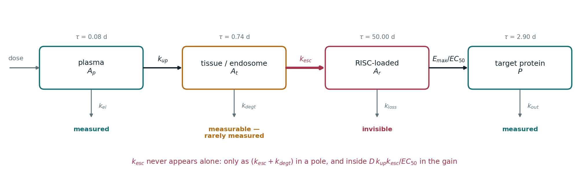
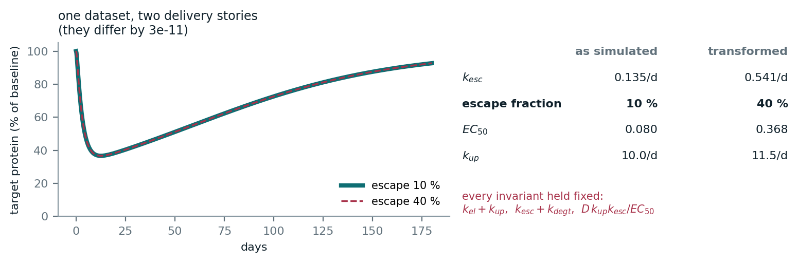
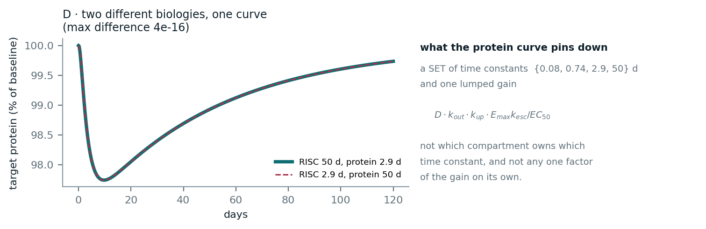
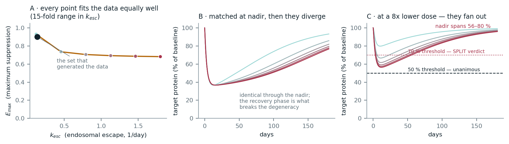
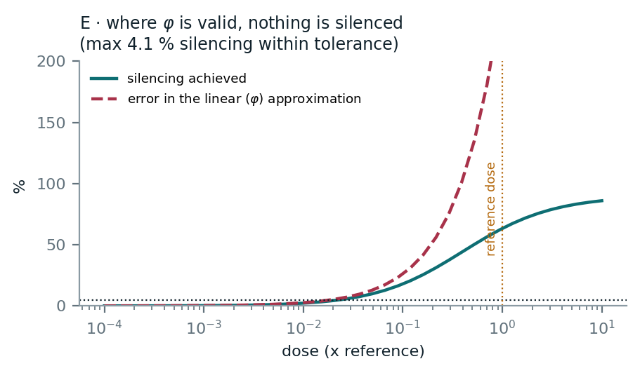
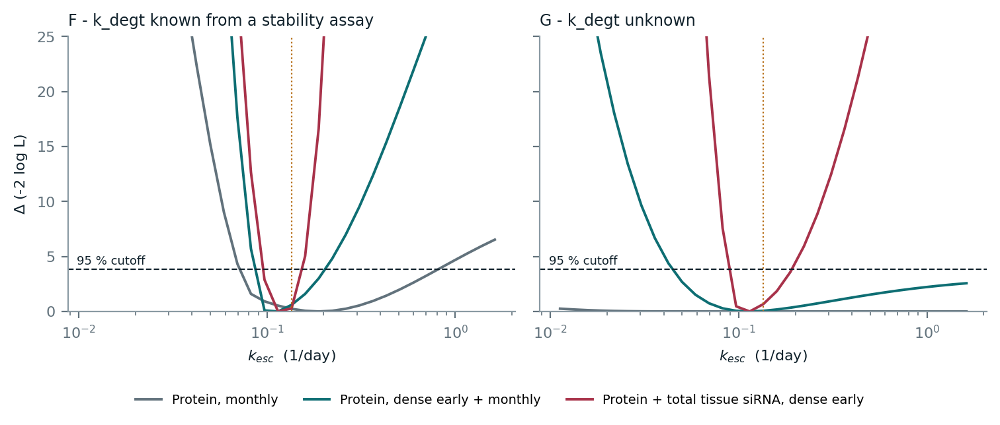

# Identifiability of endosomal escape in a minimal siRNA model

**What a four-compartment siRNA PK/PD model can and cannot tell you about
endosomal escape, whether the things it cannot tell you actually change a
decision, and which experiment is worth paying for.**



You observe the ends of the chain and not the middle. Plasma clears in hours and
gives you only the *sum* `k_el + k_up`. The RISC-loaded pool, where the drug
actually acts, is never observed. Total tissue siRNA is measurable and usually
isn't measured — and that turns out to be the decision that matters.

The model structure is standard for the modality and is **not** presented as
novel. What this repository is for is the analysis layered on top of it:
structural degeneracy, practical identifiability by profile likelihood, and a
decision-relevance test that asks whether an unresolvable parameter moves the
answer to the question actually being asked.

```
python run_all.py                    # analysis + figures + document
python run_all.py --profiles-only    # just the slow sweeps, cached incrementally
python run_all.py --quick            # coarse profile grid, smoke test
python -m pytest tests -q            # checks the claims, not just that it runs
python tests/audit.py                # re-derives every published number independently
```

Everything in `results/k_esc_identifiability.pdf` is computed by `run_all.py`
and read from `results/results.json`. There are no hard-coded scientific
numbers in the document builder, and a test enforces that.

---

## 1 · k_esc is not structurally identifiable

Not "hard to estimate" — not estimable, at any sampling density, with any
instrument.



*Two parameter sets, one four times the other in escape rate and four times the
other in escape fraction. The protein curves differ by 3e-11 — integrator
tolerance, not signal.*

The reason is exact. Rescale the upstream states by `u = A_p/D`,
`v = A_t/(D*k_up)`, `w = A_r/(D*k_up*k_esc)` and what is left carries only the
three poles — `D`, `k_up` and `k_esc` cancel. The Emax term is homogeneous of
degree zero in `(A_r, EC50)`, so it sees those parameters only through
`psi = D*k_up*k_esc/EC50`. Nine parameters reach the observables through seven
functions:

```
k_el + k_up    k_esc + k_degt    k_loss    k_out    k_syn    Emax    psi
```

so the level sets are a two-parameter group: send `k_up -> alpha*k_up`,
`k_esc -> beta*k_esc`, `EC50 -> alpha*beta*EC50`, with `k_el` and `k_degt`
absorbing the difference. `src/structural.py` proves this symbolically and
verifies it against the integrator.

The rank of the sensitivity map confirms the count and falls as observations
are added — **2** unresolved directions from plasma and protein, **1** after
adding total tissue siRNA, **0** after fixing `k_degt` from a stability assay.
The SVD null space reproduces the group generators to three decimals.

## 2 · Amplitude is not information



*In the linear regime the transfer-function denominator is symmetric under
permutation of its roots, so a 50-day RISC pool feeding a 2.9-day protein and a
2.9-day RISC pool feeding a 50-day protein are the same curve to 4e-16.
Durability is an assumption there, not an inference.*

The tissue pole — the only place `k_esc` appears without being multiplied by
`k_up` — carries about 13 % of the response amplitude. But on a monthly
sampling schedule its exponential has decayed to ~1e-17 of its initial value
before the first sample is drawn. Amplitude share is a shape metric; whether an
experiment can see a process is a property of the design.

## 3 · Does the degeneracy change a decision?



*Every point on the left reproduces the observed nadir. Centre: the curves are
identical through the nadir and separate during recovery. Right: at a lower
dose they fan out, and the verdict depends on which question you are asking.*

Against one decision rule the verdict is unanimous across the whole set — the
degeneracy is irrelevant. Against another it splits. Same ignorance, different
consequence. Most modelling anxiety about unknown parameters dissolves once you
check whether they actually move the answer, and the ones that survive that
check are the ones worth an experiment.

The set walked here is an **iso-nadir set** — one scalar constraint, which is
what you have if the nadir is all you measure. It is a different object from
the likelihood-flat manifold, and the distinction is why the curves separate
during recovery.

## 4 · phi is valid only where nothing is silenced



*Deep silencing needs `A_r` above `EC50`; the linear approximation needs it far
below. The two requirements are in direct conflict.*

`phi = Emax * k_esc / EC50` lives in the linear approximation. Holding that
approximation to 5 % relative error caps the achievable suppression at about
**4 % of baseline** — below a typical 10 % assay CV. At the reference dose,
peak `A_r` is 2.8 x `EC50` and the linear approximation misstates the depth of
silencing by 257 %. This is structural to an Emax model, not an artefact of the
chosen numbers: any parameter set that silences deeply is operating near the
ceiling.

## 5 · The experiment that matters is the tissue measurement



*A flat profile is practical non-identifiability. Left: `k_degt` known from a
stability assay. Right: `k_degt` unknown — the honest starting point.*

| Sampling design | `k_degt` known | `k_degt` unknown |
|---|---|---|
| Protein, monthly | 11.3-fold | over 144-fold |
| Protein, dense early + monthly | 2.3-fold | over 36-fold |
| Protein + total tissue siRNA, dense early | 1.6-fold | **2.1-fold** |

Moving protein sampling earlier is not enough. Adding total tissue siRNA on the
same early schedule is what collapses the interval. Dense early sampling of the
wrong readout buys almost nothing.

And the reason any of this is worth doing: without `k_esc` you cannot tell
whether an underperforming compound is a **delivery** problem or a **sequence**
problem. Those go back to different teams.

---

## Every published number is independently re-derived

`tests/audit.py` checks each headline value by a route that does not reuse the
code that produced it — the transfer function re-derived in sympy, the pole
residues recovered by least squares on the simulated curve, the nadir
recomputed with Radau instead of LSODA, the pole-swap optimum found by
brute-force grid search, the invariance group verified at further parameter
pairs, the rank ladder run across four finite-difference steps, and the
confidence bounds checked against the chi-square contour.

It caught three real errors on its first run: a validity window read off too
coarse a grid (3.28 % to 4.11 %), a rank test using a fixed singular-value
cutoff that flipped verdict with the step size, and confidence intervals taken
from grid points rather than the interpolated contour, which made every
interval 15-30 % too narrow in the optimistic direction. All three are fixed;
the script is kept so the next change can be checked the same way.

## Scope and boundaries

Stated explicitly so this is not read as claiming more than it does:

- Not a calibrated model of any real compound, conjugate, or target. The
  parameters are illustrative and should not be reused as priors. No
  proprietary, clinical, or third-party data was used.
- Single dose, single tissue, homogeneous compartments. No spatial structure,
  no cell-type heterogeneity, no repeat dosing, no saturable uptake, no mRNA
  compartment between RISC loading and protein.
- Structural identifiability is established by explicit reparameterisation on
  this specific cascade: the degenerate group is exhibited, proved
  symbolically, and verified numerically, and the sensitivity rank agrees. That
  proves the listed degeneracies exist, not that no others do. An exhaustive
  verdict wants a dedicated tool - GenSSI 2.0, DAISY, SIAN, or
  StructuralIdentifiability.jl. A GenSSI model file is in `matlab/`, written
  but not run.
- Practical identifiability is assessed at one noise level, one seed, and one
  set of designs. The fold-widths illustrate the ordering between designs; they
  are not transferable numbers.
- The experimental recommendations are qualitative pharmacology, not a
  validated assay protocol.

## The model, as equations

```
dA_p/dt = -(k_el + k_up) * A_p                            plasma   measured
dA_t/dt =  k_up*A_p - (k_esc + k_degt)*A_t                tissue   rarely measured
dA_r/dt =  k_esc*A_t - k_loss*A_r                         RISC     invisible
dP/dt   =  k_syn*(1 - Emax*A_r/(EC50 + A_r)) - k_out*P    protein  measured
```

An indirect-response structure: the Emax term multiplies a synthesis rate, so
the drug acts on production rather than elimination. The fastest and slowest
processes differ by a factor of ~600, so the system is integrated with an
implicit method rather than reduced by a quasi-steady-state assumption on the
fast compartment. `EC50` is calibrated so the reference simulation reaches the
nadir used as the worked example; every other value is set by hand and
documented in `config/reference_parameters.json`.

## Layout

```
config/reference_parameters.json   parameters and analysis settings (data, not code)
src/model.py                       ODEs, linear-regime analytic solution, poles
src/structural.py                  symbolic degeneracy group and sensitivity rank
src/analysis.py                    pole table, degeneracy sets, verdicts, phi window
src/identifiability.py             profile likelihood under three sampling designs
src/figures.py                     figures, drawn only from results.json
src/build_pdf.py                   document, built only from results.json
run_all.py                         driver; writes results/results.json
matlab/                            MATLAB cross-check, unexecuted (see its README)
tests/test_model.py                internal consistency of the claims above
tests/audit.py                     independent re-derivation of every number
```

The profile sweeps dominate runtime (several thousand stiff ODE solves) and are
cached in `results/profiles_cache.json` as each one finishes, keyed on the grid
size, seed, and noise settings. A cold run takes roughly five minutes; with the
cache warm, about eighty seconds. Delete the cache for a genuinely cold
reproduction.

## License

Code: MIT (`LICENSE`). Document and figures: CC BY 4.0 (`LICENSE-DOC`).
